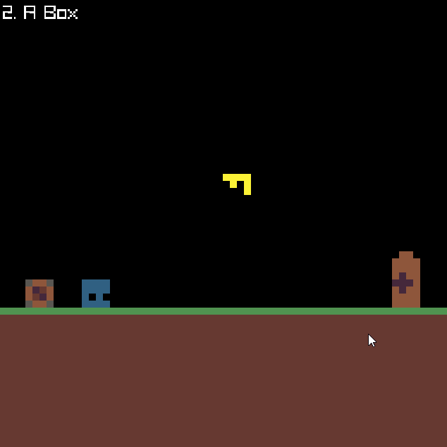

# engn64

An engine to make small games. This README is temporary, as I will be cleaning
up the project in the following weeks. A usage guide will soon be available.

## Games

engn64 was used to create [YAPAS](https://kanyatr.itch.io/yet-another-puzzle-about-scaling), a game for [GMTK 2024 game jam](https://itch.io/jam/gmtk-2024). It can be played in the browser.

